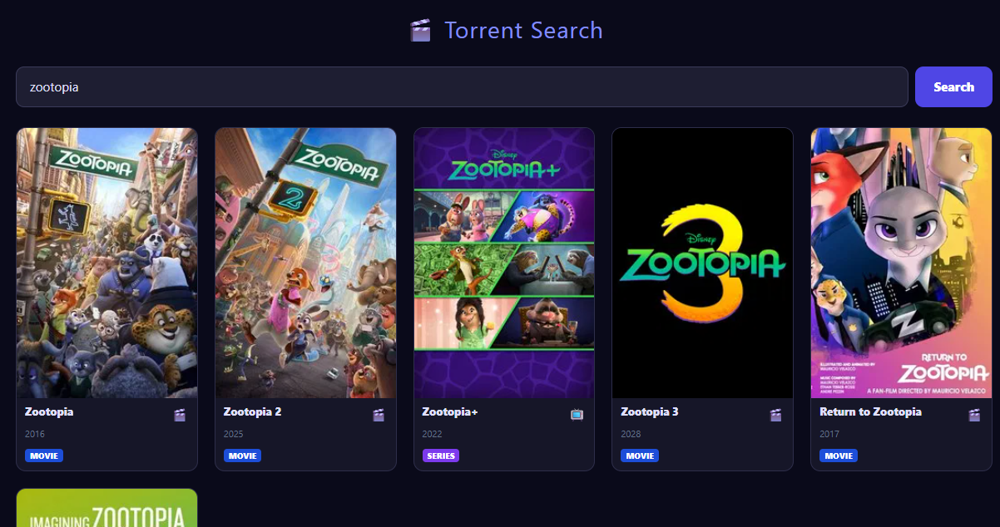

# AIOStreams Explorer

A modern React + TypeScript frontend for searching and browsing torrent streams from an [AIOStreams](https://github.com/Viren070/AIOStreams) backend. It uses TMDB to fetch movie and TV series metadata, then displays available torrents with rich filtering and sorting options.



## Features

- 🔍 Search TMDB for movies and TV series
- 🎬 Detailed view for selected titles
- 📺 TV series support with season/episode browsing
- 🧲 Magnet link listing with rich metadata (resolution, quality, languages, tags)
- ⚙️ Customizable sort priorities (seeders, resolution, quality, language)
- 🏷️ Visual tags for HDR, Dolby Vision, audio codecs, etc.
- 🔎 Real-time filtering by filename
- 🌐 Local API proxy to avoid CORS issues (development only)

## Prerequisites

- [Node.js](https://nodejs.org/) (v18+)
- [AIOStreams backend](https://github.com/example/aiostreams) running locally (or accessible via network)
- A [TMDB API key](https://www.themoviedb.org/documentation/api) (free)

## Installation

1. Clone the repository:
   ```bash
   git clone https://github.com/yourusername/aiostreams-explorer.git
   cd aiostreams-explorer
   ```

2. Install dependencies:
   ```bash
   npm install
   ```

3. Copy the example environment file and fill in your values:
   ```bash
   cp .env.example .env
   ```

## Configuration

Edit the `.env` file:

```env
# Required: TMDB API Key (get one from https://www.themoviedb.org/settings/api)
VITE_TMDB_KEY=your_tmdb_api_key_here

# The base URL of you AIOStreams backend
AIO_BASE=https://your.aiostreams.backend/api/v1

# The Authentication header accepted by AIOStreams backends needs to be a user_id:password combo encoded in BASE64
AUTH_HEADER='Basic aiostreams_<user:password>_format_base64_hex'

# Optional: Port where your AIOStreams backend runs (default 3000)
# Used only for the Vite dev server proxy.
API_PORT=3000
```

### Setting up the AIOStreams backend

You need to have the AIOStreams backend running separately. Follow its own installation instructions. Typically, it runs on `http://localhost:3000` and exposes an endpoint `/api/search?id=...&type=...`.

Make sure the backend is started **before** launching the frontend.

## Running the app

Start the development server (with hot reload):

```bash
npm run api+dev
```

The app will be available at `http://localhost:5173`.

### Proxy in development

The Vite dev server proxies all requests starting with `/api` to `http://localhost:${API_PORT}`. This avoids CORS issues when the frontend and backend are on different ports.

## Usage

1. Enter a movie or TV show title in the search bar and press Enter or click Search.
2. Click on a result to see details.
3. For movies, you'll see a list of torrents with their metadata. Use the filter panel to prioritize sorting by seeders, resolution, quality, or language.
4. For TV series, browse seasons and episodes; click an episode to open a modal with all matching torrents (season packs or individual episodes).
5. In any list, you can copy a magnet link to clipboard or open it directly in your torrent client.

## Building for production

To create a production build:

```bash
npm run build
```

The output will be in the `dist` folder. You can serve it with any static file server (e.g., `serve`, nginx). Remember to configure your web server to proxy `/api` requests to your AIOStreams backend, or set the full API URL in your environment (if you modify the code to use a different base).

## Contributing

Contributions are welcome! Please open an issue or submit a pull request.

## License

[GPLv3](LICENSE)

## Acknowledgments

- [TMDB](https://www.themoviedb.org/) for the metadata API
- [AIOStreams](https://github.com/Viren070/AIOStreams) for the torrent search backend
- [Vite](https://vitejs.dev/) and [React](https://reactjs.org/) for the awesome tooling